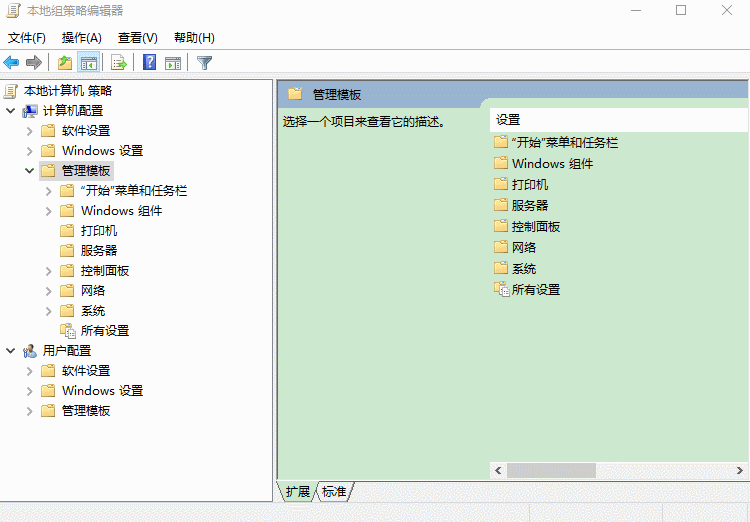
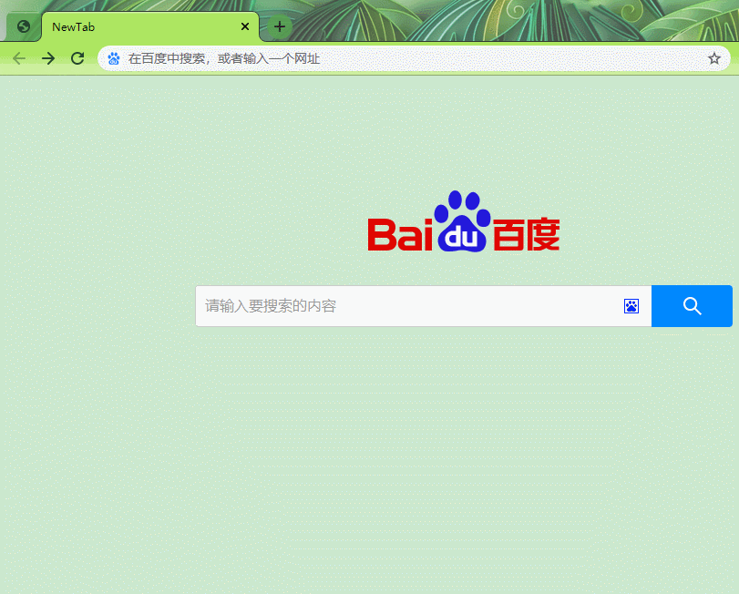

# chromeNewTab
自定义chrome新标签页。由于不想发布到chrome应用商店,因此搜了一下不用开发者模式就能用的方法。

# 使用说明
1. 下载chrome的一个【[window组策略文件](https://dl.google.com/dl/edgedl/chrome/policy/policy_templates.zip)】,解压文件后找到(\policy_templates.zip\windows\adm\zh-CN\chrome.adm)
2. 在window执行win+R,执行gpedit.msc,按照下图添加  

3. 将crx拖到chrome的扩展页面可以安装,将ID填到上面图片的白名单里面刷新一下就可以启用这个插件了
4. 我还将这个【[插件](https://chrome.google.com/webstore/detail/oficfgdfeoknbjfhommlpiekdapmnebh)】合入到我的项目里面,功能就是关闭最后一个标签页不关闭浏览器
5. 下面是演示图片，页面是用【[别人的创意](http://www.jq22.com/jquery-info21547)】,功能是我自己实现的  

# 包含功能
1. 新建标签页会使用上次切换的搜索引擎,我只用百度和谷歌
2. 会记录最近最多10次的搜索记录,鼠标点击搜索框自动出现
3. 输入内容会使用百度联想词得到最多10条联想的结果
4. 可以用鼠标点击联想词或者最近记录就能用当前选中的搜索引擎搜索,也可以键盘上下键切换选择结果按回车跳转搜索

# 总结
1. 因为chrome的新标签页不符合我的习惯,所以就自己动手了
2. 后面有好用的插件功能也可能会加到里面
3. 因为插件直接解压就能看,所以我用到别人的插件会写道readme里面注明出处
